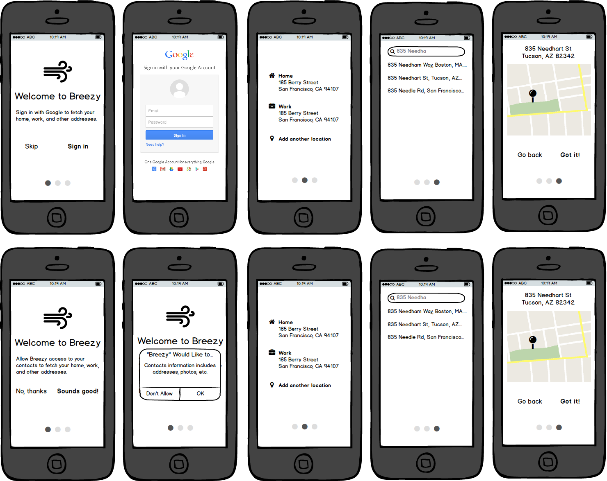
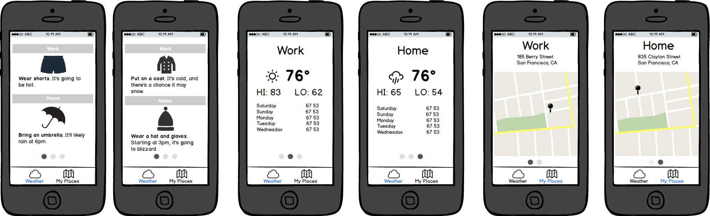
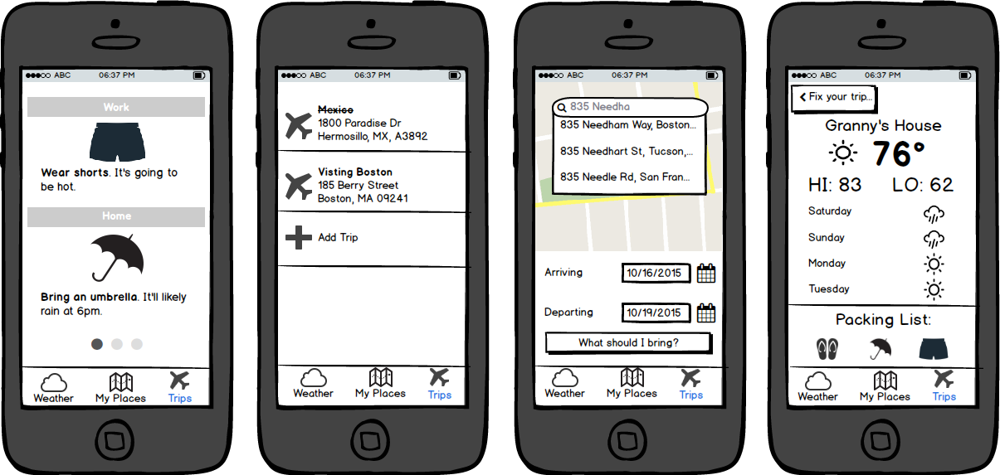
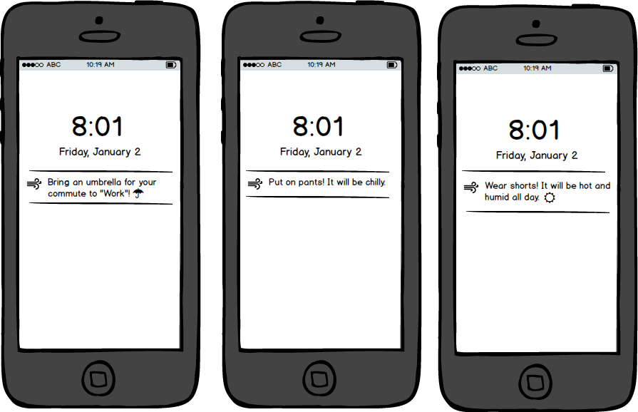

# Breezy
Codepath Group Project

## Description
Breezy makes weather about *you*. In cities like San Francisco with microclimates and varying conditions, reading through weather reports is tedious and hard. And, many people forget to do it: ending up drenched, freezing or sweating. We want to prevent that by learning which places you care about and giving you simple suggestions for what to wear or bring—integrating weather and your morning routine into one easy step.

## Wireframes

### Setup

### Current weather

### Trip planning

### Daily notifications

## User Stories

### Required
- User can enter their home and work address(es)
- User can see daily weather conditions at their home and work address on the “Today” screen
- User can see clothing/item recommendations based on weather (e.g. umbrella, sunglasses, sweater) on the “Today” screen
- User will get a push notification every morning with summarized details for weather conditions
- User can enter dates and location of a trip and see summarized weather and clothing / item recommendations for the trip, on the “Trip” screen
- User can see weather at their current GPS location on a Map view
- User can pan around Map View to see weather at different locations
- User can navigate between Today, Map and Trip screens with a tab menu.

### Optional
- User can share weather conditions with others
- User can change the settings on if and when they get the push notification
- User can share trip weather conditions with others.
- Fetch the user's frequent locations from the phone
- Fetch trips from the phone's calendar events

### Bonus
- Once the user gets to a location and stays there for a while, we send them a push notification asking them to describe the weather at that location. 
  - We then display that information on the map, or send as a push to others using the app.
